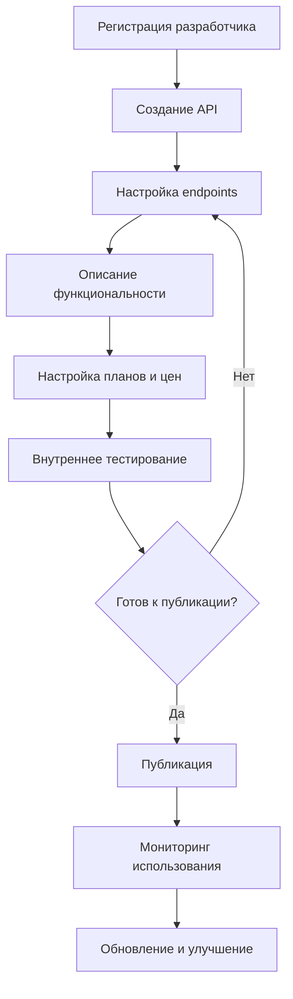
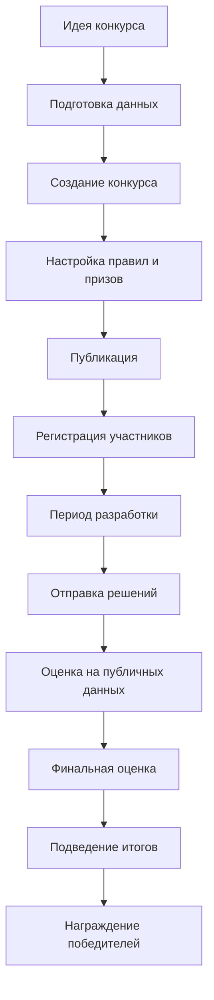
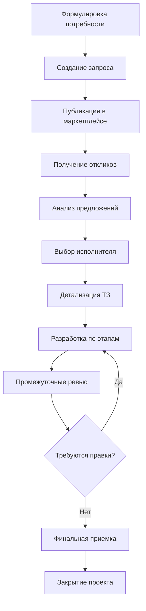

# AI Aggregator - Проектная документация

## Обзор проекта

AI Aggregator - это маркетплейс алгоритмов искусственного интеллекта, предназначенный для создания экосистемы разработчиков ИИ и потребителей их решений.

## Пользовательские сценарии и бизнес-логика

### Типы пользователей

#### 1. Неавторизованные пользователи (Гости)
- **Описание**: Посетители платформы без учетной записи
- **Ограничения**: Доступ только к публичной информации
- **Возможности**:
  - Просмотр маркетплейса (решения, конкурсы, запросы, организации)
  - Просмотр профилей организаций
  - Просмотр публичной информации о продуктах
  - Доступ к главной странице и справочной информации

#### 2. Зарегистрированные пользователи (Пользователи)
- **Описание**: Авторизованные пользователи с базовыми правами
- **Модель данных**:
  - User: email, password, verified
  - UserDetail: firstName, lastName, country, city, occupation, org, website, description
  - UserStatistics: подписки, статистика активности

#### 3. Разработчики API
- **Описание**: Пользователи, создающие и публикующие API решения
- **Специфические функции**:
  - Создание и управление API
  - Настройка endpoints и планов подписки
  - Мониторинг статистики использования

#### 4. Организаторы конкурсов
- **Описание**: Пользователи, создающие и управляющие конкурсами ИИ
- **Специфические функции**:
  - Создание конкурсов машинного обучения
  - Управление данными и метриками
  - Оценка решений участников

#### 5. Заказчики услуг
- **Описание**: Пользователи, создающие запросы на разработку
- **Специфические функции**:
  - Размещение запросов на разработку
  - Взаимодействие с исполнителями
  - Управление проектами

#### 6. Владельцы организаций
- **Описание**: Пользователи, представляющие компании или команды
- **Модель данных**: OrgSchema с участниками, статистикой, продуктами
- **Специфические функции**:
  - Управление организационным профилем
  - Координация продуктов команды
  - Ведение корпоративного блога и новостей

### Основные пользовательские пути

#### 1. Путь потребителя API

**1.1 Поиск и выбор решения**
```
Главная страница → Маркетплейс → Решения → Поиск/фильтрация → Выбор API
```

**1.2 Регистрация и настройка**
```
Регистрация → Подтверждение email → Создание приложения (APP) → Получение API ключа
```

**1.3 Интеграция и использование**
```
Изучение документации → Тестирование в Sandbox → Выбор плана → Интеграция → Мониторинг
```

**Детальные шаги:**
1. **Поиск решения**:
   - Просмотр каталога решений в маркетплейсе
   - Фильтрация по категориям (NLP, Computer Vision, Data Analysis и др.)
   - Поиск по ключевым словам
   - Изучение рейтингов и отзывов

2. **Изучение API**:
   - Просмотр описания и возможностей
   - Изучение endpoints и параметров
   - Ознакомление с ценовыми планами
   - Проверка документации

3. **Тестирование**:
   - Использование встроенного Sandbox
   - Тестовые запросы с примерами данных
   - Оценка качества ответов
   - Измерение времени отклика

4. **Подключение**:
   - Создание APP в личном кабинете
   - Получение уникального APP KEY
   - Выбор подходящего тарифного плана
   - Интеграция через предоставленные SDK

#### 2. Путь разработчика API

**2.1 Создание и настройка API**
```
Регистрация → Создание API → Настройка endpoints → Описание функциональности
```

**2.2 Публикация и продвижение**
```
Тестирование → Настройка планов → Публикация → Продвижение → Мониторинг
```

**Детальные шаги:**
1. **Подготовка к публикации**:
   - Регистрация в системе и подтверждение учетной записи
   - Развертывание API на собственной инфраструктуре
   - Подготовка документации и примеров использования

2. **Создание продукта**:
   - Создание нового API в разделе "API Editor"
   - Указание базового URL и общей информации
   - Настройка категории и тегов

3. **Настройка endpoints**:
   - Добавление endpoints с описанием методов
   - Настройка параметров (headers, query, body)
   - Указание примеров запросов и ответов
   - Настройка схем данных

4. **Ценообразование**:
   - Создание тарифных планов с лимитами
   - Установка цен за запрос или месяц
   - Настройка бесплатного tier для тестирования

5. **Публикация и продвижение**:
   - Финальное тестирование через Preview
   - Публикация в маркетплейсе
   - Мониторинг статистики использования
   - Оптимизация на основе обратной связи

#### 3. Путь участника конкурса

**3.1 Поиск и участие в конкурсе**
```
Маркетплейс → Конкурсы → Выбор → Изучение условий → Регистрация
```

**3.2 Разработка и отправка решения**
```
Загрузка данных → Разработка модели → Тестирование → Отправка → Отслеживание результатов
```

**Детальные шаги:**
1. **Выбор конкурса**:
   - Просмотр активных конкурсов
   - Изучение описания задачи и данных
   - Ознакомление с правилами и призами
   - Проверка временных рамок

2. **Регистрация на конкурс**:
   - Принятие правил участия
   - Получение доступа к данным
   - Изучение метрик оценки
   - Загрузка тренировочных данных

3. **Разработка решения**:
   - Анализ предоставленных данных
   - Разработка и тренировка модели
   - Валидация на публичных данных
   - Подготовка финального решения

4. **Отправка и мониторинг**:
   - Загрузка предсказаний в формате CSV
   - Получение публичной оценки
   - Отслеживание позиции в лидерборде
   - Возможность множественных отправок

#### 4. Путь организатора конкурса

**4.1 Создание конкурса**
```
Contest Editor → Описание задачи → Загрузка данных → Настройка временных рамок
```

**4.2 Управление и оценка**
```
Публикация → Мониторинг участников → Оценка решений → Подведение итогов
```

**Детальные шаги:**
1. **Планирование конкурса**:
   - Формулировка задачи машинного обучения
   - Подготовка тренировочных и тестовых данных
   - Выбор метрик оценки (RMSE, Accuracy и др.)
   - Определение призового фонда

2. **Создание и настройка**:
   - Создание в Contest Editor
   - Загрузка датасетов и решений-эталонов
   - Настройка этапов конкурса (Timeline)
   - Написание правил и описания

3. **Запуск и модерация**:
   - Публикация конкурса
   - Мониторинг участников и отправок
   - Ответы на вопросы участников
   - Контроль за соблюдением правил

4. **Завершение**:
   - Финальная оценка на приватном датасете
   - Формирование итогового лидерборда
   - Распределение призов
   - Публикация результатов

#### 5. Путь заказчика услуг

**5.1 Размещение запроса**
```
Request Editor → Описание задачи → Публикация → Ожидание откликов
```

**5.2 Выбор исполнителя и взаимодействие**
```
Рассмотрение откликов → Выбор исполнителя → Взаимодействие → Приемка работы
```

**Детальные шаги:**
1. **Формулировка запроса**:
   - Четкое описание технической задачи
   - Указание требований и ограничений
   - Определение бюджета и сроков
   - Выбор категории и тегов

2. **Размещение и продвижение**:
   - Создание запроса в Request Editor
   - Публикация в маркетплейсе
   - Дополнительное продвижение при необходимости
   - Ожидание откликов от разработчиков

3. **Работа с откликами**:
   - Рассмотрение предложений в разделе Responses
   - Общение с потенциальными исполнителями
   - Уточнение деталей и требований
   - Выбор наиболее подходящего исполнителя

4. **Управление проектом**:
   - Назначение исполнителя
   - Отслеживание прогресса выполнения
   - Взаимодействие через встроенный чат
   - Приемка этапов работы

5. **Завершение проекта**:
   - Финальная приемка результата
   - Оценка качества работы
   - Закрытие проекта
   - Оставление отзыва об исполнителе

### Детальные пользовательские сценарии

#### Сценарий 1: "Интеграция чат-бота с API распознавания текста"

**Участники**: Разработчик мобильного приложения (Алексей), Провайдер API (Компания "AI Vision")

**Контекст**: Алексей разрабатывает мобильное приложение для сканирования документов и нуждается в API для распознавания текста.

**Шаги выполнения**:

1. **Поиск решения (Алексей)**:
   - Заходит на главную страницу AI Aggregator
   - Переходит в "Маркетплейс" → "Решения"
   - Использует фильтр по категории "Computer Vision"
   - Ищет по ключевым словам "OCR", "текст", "распознавание"
   - Находит API "Smart OCR" от компании "AI Vision"

2. **Изучение продукта**:
   - Просматривает описание возможностей API
   - Изучает поддерживаемые форматы изображений
   - Проверяет доступные языки распознавания
   - Анализирует тарифные планы и ограничения

3. **Тестирование**:
   - Использует встроенный Sandbox для тестирования
   - Загружает пробные изображения документов
   - Проверяет качество распознавания
   - Тестирует различные endpoints

4. **Регистрация и подключение**:
   - Создает аккаунт в системе
   - Подтверждает email адрес
   - Создает новое приложение в разделе "APP"
   - Получает уникальный APP KEY
   - Выбирает подходящий тарифный план

5. **Интеграция**:
   - Скачивает SDK для своей платформы
   - Интегрирует API в код приложения
   - Настраивает обработку ошибок
   - Тестирует в dev окружении

6. **Мониторинг использования**:
   - Отслеживает количество запросов
   - Мониторит производительность API
   - Анализирует статистику использования
   - При необходимости изменяет тарифный план

**Результат**: Успешная интеграция API распознавания текста в мобильное приложение с возможностью дальнейшего масштабирования.

#### Сценарий 2: "Организация конкурса по прогнозированию цен на недвижимость"

**Участники**: Агентство недвижимости "RealEstate Pro" (Мария - аналитик), Участники конкурса (ML-инженеры)

**Контекст**: Агентство хочет улучшить свою модель прогнозирования цен и решает организовать открытый конкурс.

**Шаги выполнения**:

**Подготовка (Мария)**:
1. **Анализ задачи**:
   - Формулирует бизнес-задачу как ML-проблему
   - Подготавливает датасет с историческими данными
   - Очищает данные и создает train/test разделение
   - Выбирает метрику оценки (например, RMSE)

2. **Создание конкурса**:
   - Регистрируется в AI Aggregator
   - Переходит в "Contest Editor" → "Создать новый"
   - Заполняет название и описание задачи
   - Загружает тренировочные данные
   - Настраивает файл-эталон с правильными ответами

3. **Настройка условий**:
   - Создает временную шкалу (Timeline) конкурса
   - Устанавливает этапы: регистрация, разработка, финал
   - Прописывает правила участия
   - Определяет призовой фонд

4. **Публикация**:
   - Проходит чеклист готовности
   - Публикует конкурс в маркетплейсе
   - Продвигает через социальные сети компании

**Участие (ML-инженеры)**:
5. **Регистрация участников**:
   - Участники находят конкурс в разделе "Конкурсы"
   - Изучают описание задачи и данные
   - Регистрируются на участие
   - Принимают правила конкурса

6. **Разработка решений**:
   - Участники анализируют предоставленные данные
   - Создают и обучают модели машинного обучения
   - Тестируют решения на validation наборе
   - Готовят финальные предсказания

7. **Отправка результатов**:
   - Загружают предсказания в формате CSV
   - Получают публичную оценку на части тестовых данных
   - Отслеживают свою позицию в лидерборде
   - При необходимости корректируют и переотправляют

**Завершение (Мария)**:
8. **Подведение итогов**:
   - Система автоматически оценивает решения на полном тестовом наборе
   - Формируется финальный лидерборд
   - Победители получают призы
   - Лучшие решения могут быть предложены для коммерческого использования

**Результат**: Агентство получает улучшенную модель прогнозирования, участники - опыт и призы, сообщество - новые benchmarks.

#### Сценарий 3: "Поиск разработчика для создания рекомендательной системы"

**Участники**: Интернет-магазин "TechShop" (Дмитрий - CTO), Разработчик ИИ (Елена)

**Контекст**: Интернет-магазин нуждается в персонализированной рекомендательной системе для увеличения продаж.

**Шаги выполнения**:

**Размещение запроса (Дмитрий)**:
1. **Анализ потребностей**:
   - Определяет техническое задание
   - Оценивает бюджет и временные рамки
   - Подготавливает описание существующей инфраструктуры
   - Определяет критерии успешности проекта

2. **Создание запроса**:
   - Регистрируется в AI Aggregator
   - Переходит в "Request Editor" → "Создать новый"
   - Заполняет техническое описание задачи
   - Указывает требования к технологиям и опыту
   - Устанавливает бюджет и дедлайны

3. **Публикация**:
   - Выбирает подходящую категорию (Data Analysis/ML)
   - Добавляет релевантные теги
   - Публикует запрос в маркетплейсе
   - Начинает получать отклики от разработчиков

**Отклик и выбор (Елена)**:
4. **Поиск проектов**:
   - Елена просматривает раздел "Запросы" в маркетплейсе
   - Фильтрует по своей специализации
   - Находит проект TechShop
   - Изучает техническое задание

5. **Подача отклика**:
   - Анализирует техническую сложность
   - Готовит предложение с описанием подхода
   - Указывает свой опыт в похожих проектах
   - Предлагает временные рамки и стоимость

**Взаимодействие и выполнение**:
6. **Выбор исполнителя (Дмитрий)**:
   - Рассматривает поступившие отклики
   - Проводит интервью с лучшими кандидатами
   - Проверяет портфолио и отзывы
   - Выбирает Елену как исполнителя

7. **Планирование проекта**:
   - Детализируют техническое задание
   - Согласовывают этапы разработки
   - Устанавливают промежуточные дедлайны
   - Определяют формат отчетности

8. **Разработка**:
   - Елена начинает работу над рекомендательной системой
   - Регулярно отчитывается о прогрессе через встроенный чат
   - Дмитрий предоставляет необходимые данные и доступы
   - Проводятся промежуточные ревью и корректировки

9. **Тестирование и внедрение**:
   - Система тестируется на исторических данных
   - Проводится A/B тестирование с пилотной группой
   - Анализируются метрики эффективности
   - Система внедряется в продакшн

10. **Завершение проекта**:
    - Елена передает код и документацию
    - Дмитрий проводит финальную приемку
    - Проект закрывается с положительными отзывами
    - Устанавливаются долгосрочные отношения для поддержки

**Результат**: TechShop получает работающую рекомендательную систему, увеличивающую конверсию. Елена - новый проект в портфолио и положительные отзывы.

### Бизнес-процессы

#### 1. Процесс публикации API



#### 2. Процесс проведения конкурса



#### 3. Процесс выполнения запроса на разработку



### Интеграции и взаимодействия

#### 1. Внешние интеграции

**Системы оплаты**:
- YooKassa для обработки платежей
- Поддержка различных способов оплаты
- Автоматическое управление подписками

**Облачные хранилища**:
- Yandex Cloud для хранения файлов
- Vercel Blob как альтернативное решение
- Автоматическое управление аватарами и медиа

**Системы аутентификации**:
- Email-based аутентификация
- JWT токены для сессий
- Двухфакторная аутентификация (планируется)

#### 2. Внутренние интеграции

**База данных**:
- MongoDB для основного хранения данных
- Redis для кеширования (планируется)
- PostgreSQL для аналитики (в разработке)

**API Gateway**:
- Центральная точка для всех API запросов
- Rate limiting для предотвращения злоупотреблений
- Логирование и мониторинг запросов

**Поисковая система**:
- Встроенный поисковый движок
- Полнотекстовый поиск по продуктам
- Фильтрация по категориям и тегам

#### 3. Микросервисная архитектура

**Основные сервисы**:
- `aiag_back`: Основное API и веб-интерфейс
- `aiaghub`: Центральный хаб для API интеграций
- Отдельные сервисы для каждого типа продукта

**Взаимодействие сервисов**:
- RESTful API для синхронного взаимодействия
- Event-driven архитектура для уведомлений
- Shared database для некоторых общих данных

### Метрики и аналитика

#### 1. Бизнес-метрики

**Для API**:
- Количество запросов в день/месяц
- Доходность по API
- Количество активных подписчиков
- Среднее время отклика

**Для конкурсов**:
- Количество участников
- Качество решений (по выбранным метрикам)
- Вовлеченность сообщества
- Количество повторных участий

**Для запросов**:
- Время от создания до закрытия
- Процент успешно выполненных проектов
- Средний бюджет проектов
- Рейтинг удовлетворенности

#### 2. Технические метрики

**Производительность**:
- Время загрузки страниц
- Доступность сервисов (uptime)
- Пропускная способность API
- Использование ресурсов

**Качество**:
- Количество ошибок в API
- Успешность развертываний
- Покрытие тестами
- Время восстановления после сбоев

### Безопасность и конфиденциальность

#### 1. Аутентификация и авторизация

**Система ролей**:
- Базовый пользователь
- Владелец продукта
- Администратор организации
- Системный администратор

**Контроль доступа**:
- JWT токены с ограниченным временем жизни
- API ключи для машинного доступа
- IP-фильтрация для критических операций
- Rate limiting для предотвращения атак

#### 2. Защита данных

**Персональные данные**:
- Шифрование чувствительных данных
- Соблюдение требований GDPR
- Право на забвение
- Аудит доступа к данным

**Коммерческая информация**:
- Защита API endpoints
- Безопасное хранение кода решений
- Контроль доступа к конфиденциальным данным конкурсов

### Масштабирование и развитие

#### 1. Техническое масштабирование

**Горизонтальное масштабирование**:
- Microservices архитектура
- Container-based развертывание
- Load balancing между инстансами
- Auto-scaling на основе нагрузки

**Производительность**:
- CDN для статических ресурсов
- Кеширование часто запрашиваемых данных
- Оптимизация базы данных
- Асинхронная обработка тяжелых операций

#### 2. Функциональное развитие

**Планируемые возможности**:
- Мобильные приложения
- Расширенная аналитика
- Системы рекомендаций
- Интеграция с популярными IDE
- Маркетплейс готовых решений
- Система менторинга и обучения

**Интеграции**:
- GitHub/GitLab для управления кодом
- Docker Hub для контейнеризированных решений
- Cloud platforms (AWS, GCP, Azure)
- Popular ML frameworks и библиотеки

Этот документ представляет собой живую документацию, которая будет обновляться по мере развития платформы и появления новых функций.