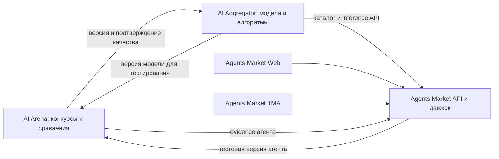

# Интеграция трёх продуктов и четырёх приложений

Дата: 06.09.2026. Целевая архитектура, не описание уже работающей системы.

## Границы

Продукты выпускаются независимо, не пишут напрямую в чужие таблицы. У Agents Market Web и TMA общие правила, серверные данные и экономика, но отдельные приложения, сборки и проверка релиза. Web не зависит от запуска Telegram. Общий визуальный язык допустим; одинаковые навигация и плотность экранов не обязательны.

На старте достаточно существующих backend/worker технологий и HTTP API. Новая общая инфраструктура вводится только при доказанной необходимости. Вынос БД и перемещение папок — управляемые задачи после сверки, а не предпосылка написания первого контрактного теста.

| Данные / операция | Владелец | Что могут другие |
|---|---|---|
| Commercial artifact/version, модель, доступность, retail price | Aggregator | Читать публичный каталог, создавать draft через API, покупать вызов |
| Provider credentials, себестоимость, routing, model-call ledger | Aggregator | Получать свою usage-квитанцию; не читать upstream таблицы |
| Challenge, submission, dataset, evaluation, vote, ranking, prize | Arena | Экспортировать разрешённый отчёт/ссылку на закреплённую версию |
| Agent template/version, instance, hire, run, runtime secret, session | Agents Market | Публичный manifest; специальный тестовый adapter с ограниченным доступом |
| Agent-service ledger, авторская доля и выплаты агента | Agents Market | Получать собственные документы/квитанции, агрегированные отчёты при разрешении |
| Профиль пользователя внутри продукта | Соответствующий продукт | Явно согласованная связь идентичности, не доступ ко всей БД профилей |

Алгоритм/агент/RAG может быть коммерческим исполняемым API в Aggregator; эксплуатационная копия, долгий workflow, наём и приватная память живут в Agents Market. Две карточки ссылаются на исходную версию, а не создают двух владельцев одного объекта. Автору показывается, что именно он публикует: API-доступ или шаблон/услугу агента.

## Контракт версии решения

Предлагаемый `ArtifactManifest v1`:

| Поля | Правило |
|---|---|
| `artifact_id`, `version_id`, `source_product`, `source_ref` | Глобально однозначная ссылка `(source_product, artifact_id, version_id)`, локальные числовые ID не смешиваются |
| `kind` | `model`, `agent`, `rag`; отдельные capabilities определяют конкретный протокол вызова |
| `content_digest`, `runtime_revision`, `config_digest` | Неизменяемая версия; не ссылаться только на плавающий latest |
| `owner_subject`, `contributors`, `rights_revision` | Подтверждённый владелец и согласованные права/доли команды; без персональных секретов |
| `input_schema`, `output_schema`, `capabilities` | Формат входа/выхода, stream/async/tools/context ограничения |
| `invocation_ref` | Ссылка на adapter/защищённый endpoint; credentials передаются вне manifest |
| `license`, `data_policy`, `commercialization_allowed` | Право на публикацию и ограничения данных; результат конкурса не означает передачу авторских прав |
| `evaluation_refs` | Ссылки на evidence для этой версии, а не произвольный числовой рейтинг |

Для внешнего endpoint digest manifest не гарантирует неизменность удалённого кода. В отчёте различать аттестацию immutable артефакта и измерение поведения endpoint в конкретный период; назначать срок актуальности и повторные проверки. Рейтинг версии нельзя молча переносить на обновлённый endpoint.

`EvaluationEvidence v1`: subject version/digest, method/evaluator version, dataset/corpus digest, условия tool/data/time/cost, число повторов/seed, показатели и неопределённость, public/final visibility, статус/дата, URI отчёта и checksum. Authenticity: подписанный экспорт либо проверяемый серверный fetch у Arena. Нельзя доверять score, присланному браузером автора.

## API и события

Пути ниже **предлагаемые**, кроме существующего семейства `/v1/models` и inference. До реализации сверить с текущим API, зафиксировать schemas и совместимость.

| Контракт | Производитель → потребитель | Основной эффект |
|---|---|---|
| `GET /v1/models` + capabilities/retail price revision | Aggregator → Agents Market/Arena | Клиент получает разрешённые модели и условия без SQL и себестоимости |
| Inference endpoints + async job status/cancel | Aggregator → Agents Market/Arena | Вызов с tenant credential, лимитом, request_id; receipt/usage после завершения |
| `GET /v1/usage/{request_id}` | Aggregator → покупатель | Авторитетный результат списания/отмены/неопределённости; не реконструкция цены по UI |
| `POST /v1/publication-drafts` | Arena/Agents Market → Aggregator | Идемпотентный черновик по immutable manifest с правами автора |
| `POST /v1/evaluations` / status | Aggregator/Agents Market → Arena | Ограниченный тестовый запуск после согласия и проверки бюджета |
| `GET /v1/evidence/{id}` | Arena → каталоги | Проверяемая версия отчёта с visibility/authz |
| Agents API: templates, instances, hires, runs, billing | Agents Market → Web/TMA | Общий доменный backend с одинаковыми серверными правилами |

Для HTTP контрактов — [OpenAPI](https://spec.openapis.org/oas/latest.html); выбирается поддержанная генераторами версия. Для оболочки событий можно использовать [CloudEvents](https://github.com/cloudevents/spec/blob/main/cloudevents/spec.md). Это формат обмена; надёжность доставки обеспечивается кодом продуктов.

Минимальные события: `artifact.version_published`, `artifact.version_suspended`, `evaluation.completed`, `evaluation.invalidated`, `usage.settled`, `publication.rejected`. Поля: event id, source, type, time, subject, schema revision, correlation id, payload. События не содержат ключей, приватных промптов, личной памяти и закрытых тестов.

Запись доменного изменения и outbox — в одной локальной транзакции. Доставка с повторами, inbox UNIQUE(source,event_id), dead-letter и ручной replay, периодическая сверка пропущенных состояний. «Exactly once» через сеть не обещается: ровно один бизнес-эффект обеспечивается локальными guards/dedup. Consumer не должен применять устаревшее событие поверх новой revision. Между БД не строить распределённую транзакцию.

## Идентичность и права

Первый вертикальный срез работает через service credentials и подтверждённые ссылки аккаунтов: общий SSO не должен блокировать inference. Для пользователя можно позже добавить общий identity provider, сохраняя локальные роли и кошельки. Telegram account связывается с web только после подтверждения владения обоими; совпадение email/username не достаточное основание.

Web и TMA не хранят provider service key в браузере. Backend обращается к Aggregator с отдельным service account/org для продукта, ограниченными scopes и бюджетами. Для тестов Arena — отдельный бюджет/учётка, не production-кошелёк агента или автора. Доступ к чужим reports, drafts, runs и usage проверяется сервером.

## Денежная модель

1. Пользователь покупает услугу агента у Agents Market.
2. Agents Market резервирует лимит пользовательского run и покупает inference у Aggregator своим клиентским кошельком.
3. Aggregator учитывает upstream расход, цену продажи, авторскую долю модели и возвращает receipt с `request_id`, unit/currency, scale, price revision и фактическим usage.
4. Agents Market учитывает inference как себестоимость, добавляет только заранее раскрытые tool/runtime/agent fees и долю автора агента; завершает run и освобождает остаток резерва.
5. Prize payout Arena — отдельный процесс. Победа не автоматически зачисляет credits в Aggregator или Agents Market.

Все деньги — целые минимальные единицы или строгое decimal представление, единицы/scale обязательны. Не смешивать рубли, центы, micro-USD и «кредиты» без зафиксированного курса и округления. Цена/FX snapshot хранится с операцией; изменение тарифа не меняет старую квитанцию. Цифры комиссий в плане не устанавливаются.

Если upstream завершил запрос, но клиент не получил ответ, определить `pending_reconciliation`, узнать состояние по request_id и применить договорённую политику. Нельзя автоматически повторять платную генерацию как безопасный GET. При refund уже потреблённых средств фиксировать reversal/долг/ограничение дальнейших трат, а не терять возврат из-за недостаточного текущего баланса.

Учётные инварианты: сумма распределённых частей равна принятой сумме с явным правилом округления; остаток = начальный + credits − debits − reserves с корректным освобождением; одна внешняя оплата имеет одну локальную операцию; все отмены связаны с исходной проводкой. Сводная аналитика исключает внутреннюю B2B-продажу при расчёте общей внешней выручки экосистемы.

## Публикация из Arena

`draft submission → accepted version → evaluation → eligible for publication → author consent → marketplace draft → moderation → live version`.

Результат оценки не является автоматическим разрешением продавать. Проверить права на код/веса/данные, согласие команды, коммерческую лицензию и работоспособность endpoint. Если организатор ограничил коммерциализацию или исходники закрыты, соответствующая публикация запрещается без дополнительных прав. Приватные final-наборы не экспортируются.

Модель/RAG API публикуется в Aggregator; агентский шаблон — в Agents Market; при наличии самостоятельного API агент может иметь и listing в Aggregator с явной связью версий. Маршрутизация публикации следует выбору автора, а не типу страницы, на которой он нажал кнопку.

## Обязательные сквозные проверки

| ID | Сценарий | PASS |
|---|---|---|
| INT-01 | Модель Arena → Aggregator | Разрешённая версия создаёт один draft, проходит модерацию, вызывается по API, автор получает начисление |
| INT-02 | Агент Market → Arena → Market | Экспортированы только разрешённые данные; evidence вернулось к той же версии |
| INT-03 | Run из Web и из TMA | Оба используют общий API; права/баланс/история согласованы; разные run имеют разные correlation id |
| INT-04 | Повтор webhook/job/event | Один business effect независимо от порядка и повторов |
| INT-05 | 401/403/402 Aggregator | Нет обхода прямым upstream; расход остановлен и клиент видит корректную причину |
| INT-06 | Obsolete/suspended version | Новые вызовы следуют политике; активные run завершаются/отменяются корректно; рейтинг не мигрирует |
| INT-07 | Сбой Arena | Продажи/агенты продолжают работать; evidence помечено устаревшим, без фальшивого обновления |
| INT-08 | Сбой Aggregator | Run не теряется и не списывается дважды; retry ограничен и соответствует idempotency policy |
| INT-09 | Изоляция | Чужие keys, scopes, traces, hires, usage, private datasets недоступны во всех клиентах |
| INT-10 | RAG и agents fairness | Одинаковые corpus/tools/budgets; public/final разделены; условия видны в отчёте |
| INT-11 | Identity linking | Подтверждение двух аккаунтов; запрет account takeover; корректны unlink и активные сессии |
| INT-12 | Refund/payout/reconcile | Все продуктовые журналы сходятся; корреляция восстановима; повтор не меняет итог |
| INT-13 | Независимые релизы | Новая версия одного frontend/backend не ломает предыдущую поддержанную версию другого |
| INT-14 | Восстановление | Backup + outbox replay восстанавливают состояние без повторного списания/публикации |

Для каждого сценария сохранять test id, commit всех участников, environment, trace/correlation, ожидаемые и фактические эффекты. Для INT-03/09/11/13 обязательны доказательства и Web, и TMA. Выпуск v1 допускается после закрытия продуктовых scorecards и всех 14 сценариев, с утверждённым рабочим runbook.

## Разделение работ по папкам

- Aggregator: gateway, каталог, commercial artifact, B2B-usage, retail ledger и author model earnings.
- Arena: конкурсы, runner/evidence/rating, prize ledger, export draft producer.
- Agents Market: общий API, agent-worker, agent-service ledger и шаблоны; отдельно `apps/web` и `apps/tma`.
- Контракты: небольшой версионированный пакет схем и примеров, подключаемый потребителями. Сервисные данные и секреты в общий пакет не входят.

При E0 решить, какие существующие пакеты действительно общие, и зафиксировать release-процесс. Сначала убрать прямые cross-product SQL-зависимости, затем выделять хранилища и репозитории по выбранной карте. Нынешние репозитории не перезаписывались, production не менялся.
