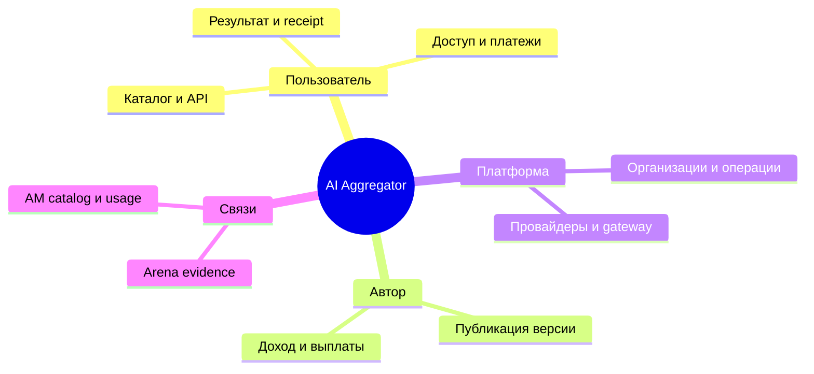

# Карта функционала AI Aggregator

Срез на **08.09.2026**. Это продуктовая карта, составленная по исходникам, принятому локальному evidence и планам. Она не является новой приёмкой, не пересчитывает F=43/108 и не подтверждает production: развёртывание, реальные платежи и платные вызовы провайдеров в этом срезе не проверялись.

**Статусы:** «исходники» — путь существует; «принято локально» — есть зафиксированная локальная проверка/review; «production не проверен» — обязательный внешний или сквозной gate не пройден; «план» — будущая работа. Quota v2 DB prerequisite принят локально 08.09 после независимых финансового и TypeScript review; публичный маршрут ещё не подключён.

| Раздел | Функции и путь пользователя | Текущий статус | Что осталось | Evidence / план |
|---|---|---|---|---|
| AG-01. Каталог | Найти модель, увидеть карточку и доступность | Исходники поиска/карточек есть; production не проверен | Версии цены/лицензии, достоверные availability и evidence Arena | [F-срез](/home/bob/Projects/ai-aggregator/docs/ecosystem/2026-09-07-functional-checkpoint.md), [AG-P2](/home/bob/Projects/ai-aggregator/docs/superpowers/plans/2026-09-07-production-continuation.md) |
| AG-02. Первый вызов | Войти, получить ключ, вызвать модель/playground | Auth и ключевые маршруты существуют; оплаченный путь не принят | Восстановление сессии, понятный расход и результат для клиента | [F-срез](/home/bob/Projects/ai-aggregator/docs/ecosystem/2026-09-07-functional-checkpoint.md) |
| AG-03. Доступ и оплата | Пополнить баланс, получить доступ, запросить возврат | RUB bridge/refund primitives в исходниках; production не проверен | Единый grant/refund/debt flow, renewal; TON exact amount/asset/quote contract `a5731d4` принят локально; invoice/verifier/payment и wallet login/link — план рядом с RUB | [план TON](/home/bob/Projects/ai-aggregator/docs/superpowers/plans/2026-09-07-ton-payments.md) |
| AG-04. Исполнение и списание | Запрос → reserve → provider → usage → receipt | Stored plaintext executor, quota v2 bridge и DB HTTP storage a6c0513 с typed seam77f0148 приняты локально; restricted plaintext route использует их и принят локально; default legacy и production не переключались | Canonical HTTP identity принят (`b4ce9f3`); C1a SQL reject/recovery принят (`a0b6eb8`); C1b typed bridge принят (`0f0b395`, `fb849ae`); HTTP/config contract MC1 принят (`41ede0c`), route composition MC2 `ac23cae` принят локально с mock-based checks, native MC3/MC4 принят (`cd37771`, test fix `1c072b3`, final46/native + baseline315, independent Approved); остаётся refund cutover; clean71 rehearsal принят локально (`f4cd433`, SQL `a0b6eb8`), production cutover открыт | [entrypoint](/home/bob/Projects/ai-aggregator/docs/DEVELOPMENT-ENTRYPOINT.md), [quota design](/home/bob/Projects/ai-aggregator/docs/superpowers/plans/2026-09-07-durable-spending-quotas.md) |
| AG-05. Провайдеры | Выбрать совместимую модель, пережить отказ | Adapters/failover существуют в исходниках | Capability contract, price revision, общий предел попыток и честный fallback | [AG-P2](/home/bob/Projects/ai-aggregator/docs/superpowers/plans/2026-09-07-production-continuation.md) |
| AG-06. Автор и публикация | Подать модель, пройти moderation, дать пользователю вызываемую версию | Заявка и approve существуют; approve пока активирует listing | Immutable runtime version, безопасный probe, update/rollback | [F-срез](/home/bob/Projects/ai-aggregator/docs/ecosystem/2026-09-07-functional-checkpoint.md) |
| AG-07. Доход автора | Увидеть начисление, выплату и отмену | Кабинет и заготовки ledger существуют | Earnings hook в settle, payout/reversal и спорные статусы | [AG-P3](/home/bob/Projects/ai-aggregator/docs/superpowers/plans/2026-09-07-production-continuation.md) |
| AG-08. Организации и права | Роли, ключи, доступ команды | Серверные роли, ключи и egress есть в исходниках | Полная tenant-матрица, защита author secrets, quota всех денежных routes | [F-срез](/home/bob/Projects/ai-aggregator/docs/ecosystem/2026-09-07-functional-checkpoint.md) |
| AG-09. Асинхронные результаты | Отправить job, дождаться/отменить, получить одно состояние | Queue/API есть; polling и sink не завершены | Deadline/cancel, restart-safe outcome и polling/sink | [AG-P5](/home/bob/Projects/ai-aggregator/docs/superpowers/plans/2026-09-07-production-continuation.md) |
| AG-10. Интерфейс | Buyer, author и admin проходят основной сценарий | Основные страницы существуют | Полные сценарии, ошибки, mobile/a11y и truthful UX | [production continuation](/home/bob/Projects/ai-aggregator/docs/superpowers/plans/2026-09-07-production-continuation.md) |
| AG-11. Поддержка и эксплуатация | Выпустить, восстановить, разобрать спор | Native test/migration contracts приняты локально | Release gate, restore rehearsal, операторская сверка и disputes | [checkpoint](/home/bob/Projects/ai-aggregator/docs/consolidation/2026-09-07-pause-checkpoint.md) |
| AG-12. Связь хаба | Передать каталог/usage AM, прикрепить evidence Arena | Базовые API существуют; сквозная интеграция не принята | Rich HTTP catalog, version/evidence/rights manifests и авторский выпуск | [кооперативная roadmap](/home/bob/Projects/ai-aggregator/docs/ecosystem/2026-09-07-cooperative-roadmap.md) |

Ближайший продуктовый маршрут: после принятых quota v2 DB, typed executor bridge и DB HTTP identity/resultbox и typed storage seam — принятые canonical HTTP identity и C1a SQL reject/recovery, принятый C1b typed bridge и затем один публичный plaintext route с точной idempotency и recovery/refund; после этого — rich catalog для AM, авторская версия и TON/RUB regression. Tools, SSE, media и BYOK идут после первого доверенного маршрута. Arena и AM подключаются через versioned HTTP contracts, без общей БД или общего баланса.

Кооперативные программы, общая память продукта, мем-конкурс и программы паёв/мем-токенов отложены: это не активная функция Aggregator и не относится к TON payment или wallet login/link. Приоритет общего потока остаётся **AG → Arena → AM**.
