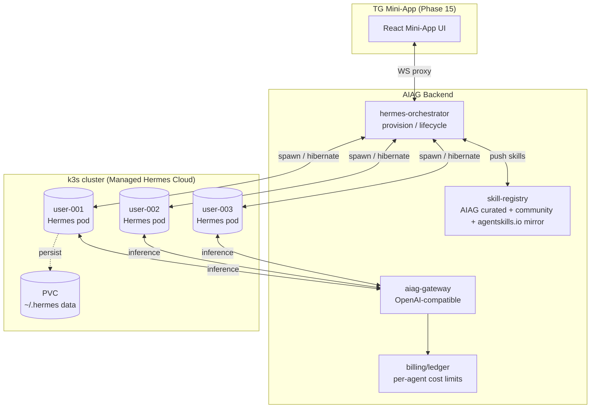
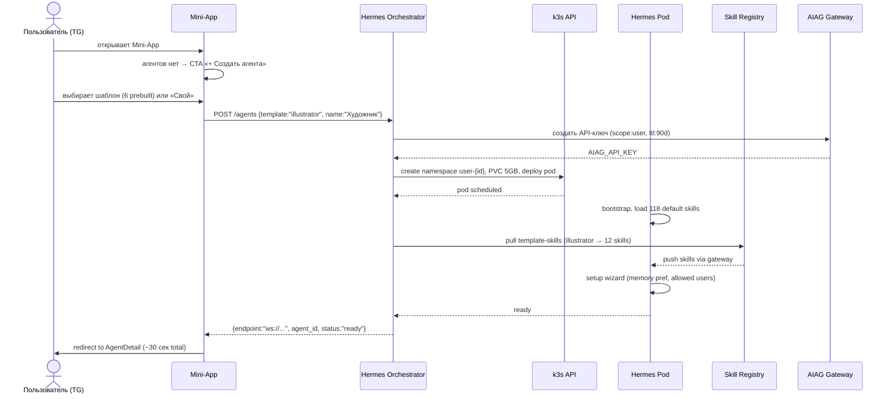
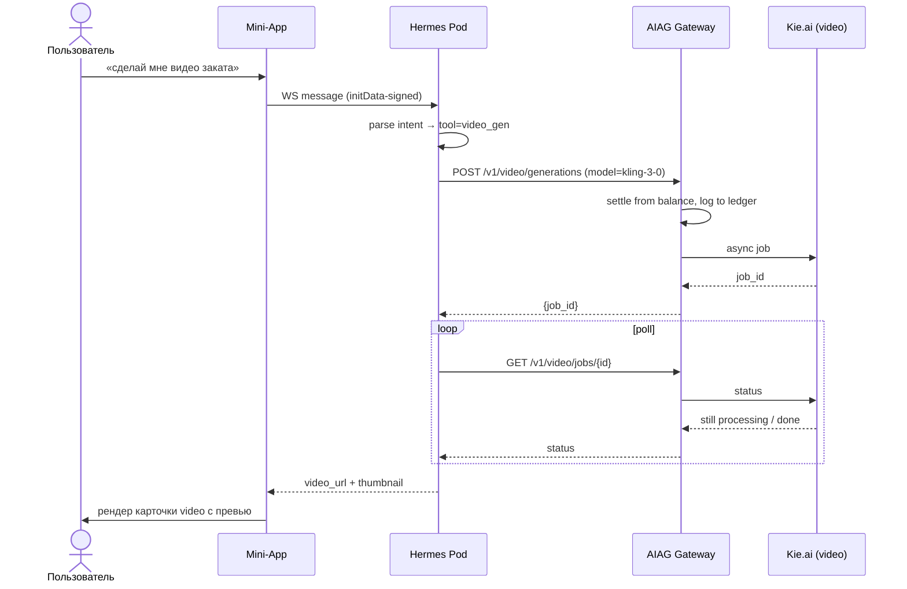
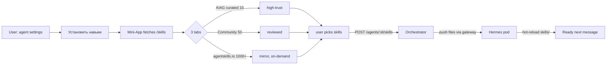
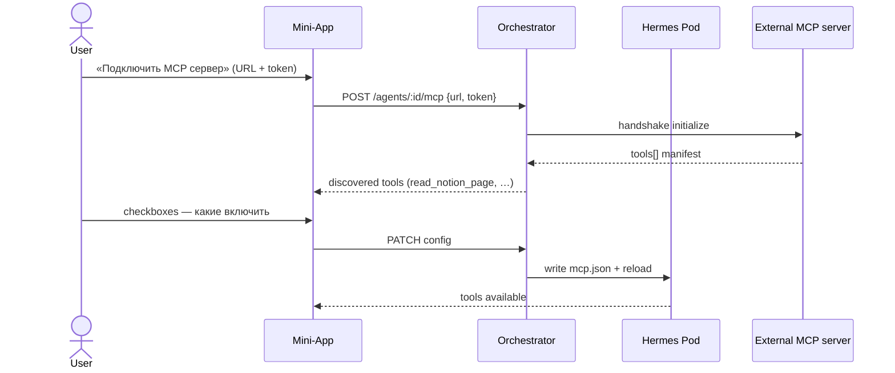
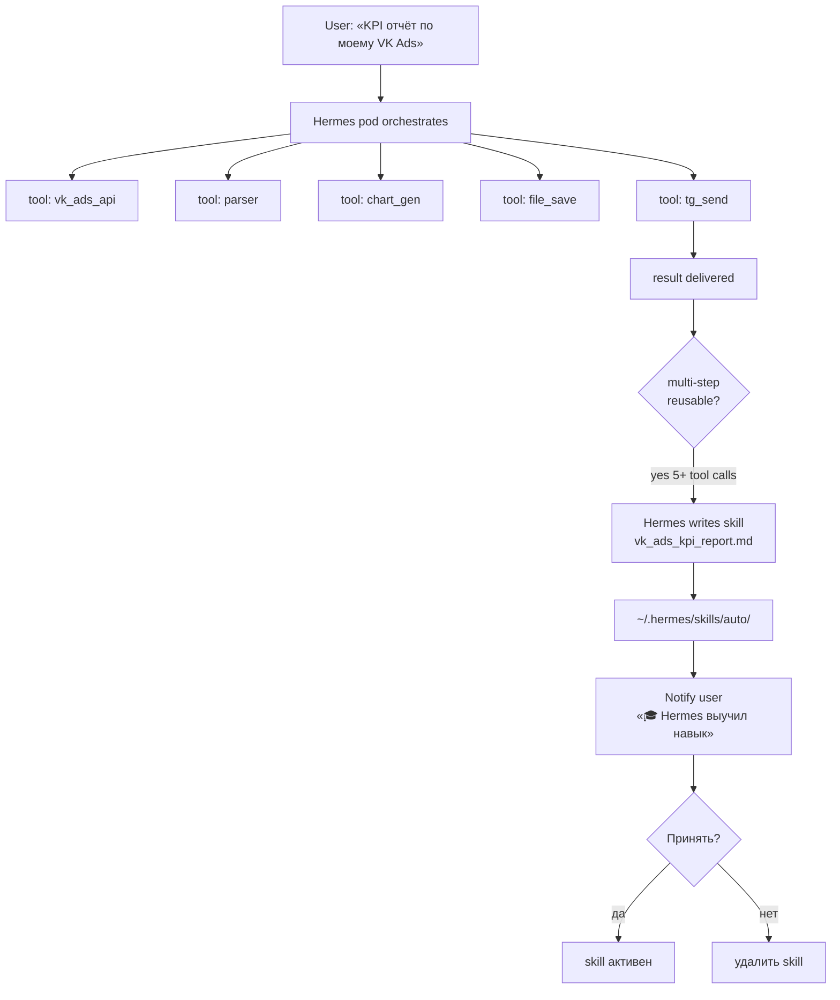
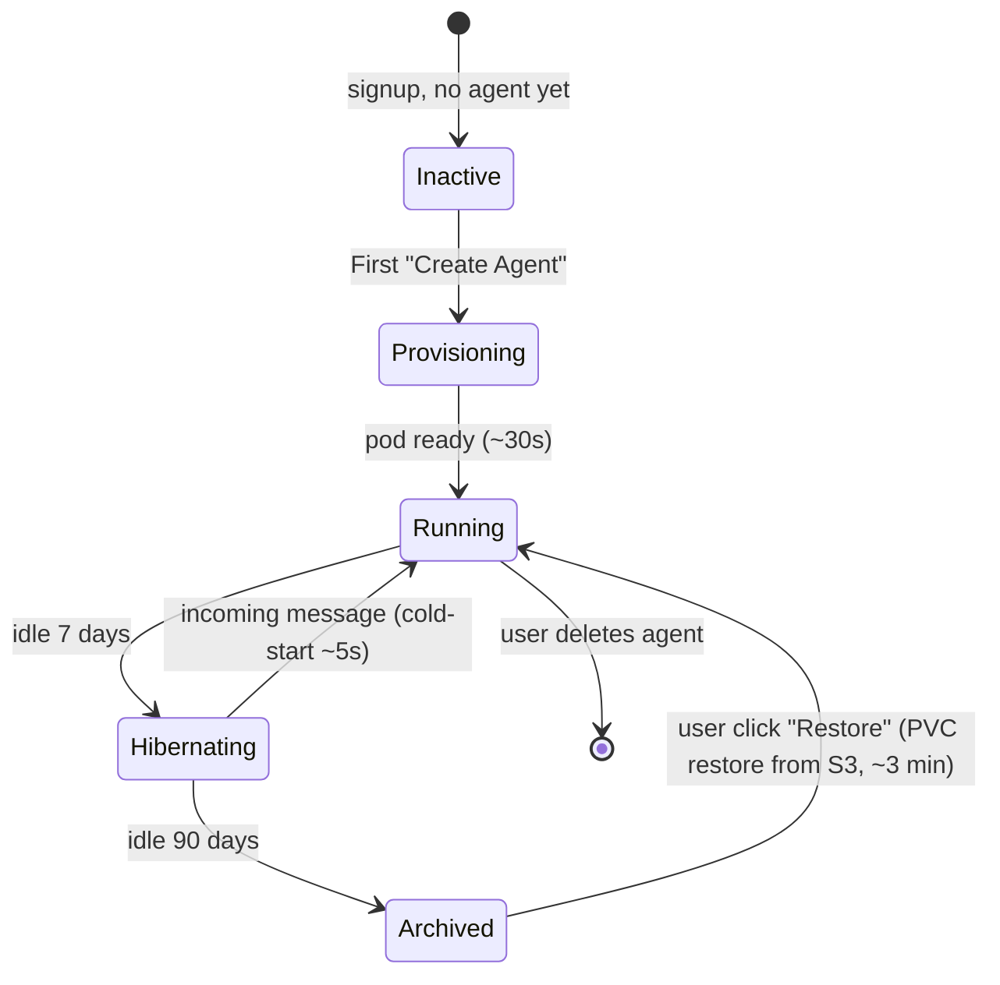

# Phase 17 — Hermes Agent Integration (Managed Hermes Cloud)

**Date:** 2026-05-08
**Status:** Design
**Phase dir:** `.planning/phases/17-hermes-agent-integration-managed-cloud-skills-mcp-for-mini-a/`
**Depends on:** Phase 15 (TG Mini-App), Phase 16 (x402), future Phase 02 (k3s cluster)

---

## 1. Контекст и стратегическое решение

AIAG Mini-App (Phase 15) даёт пользователю каталог моделей и баланс. Чтобы превратить Mini-App в полноценный «AI-помощник в кармане», нужен агент-runtime — слой над моделями, который умеет рассуждать, держать память, вызывать инструменты, учиться. Писать собственный фреймворк дорого и медленно. Решение — взять зрелый open-source агент **Hermes Agent** (Nous Research, MIT, 32k+ stars) и захостить его в режиме «Managed Cloud» (опция А).

### Ключевые факты о Hermes Agent (релевантные для дизайна)

- Open-source (MIT), репо `nousresearch/hermes-agent`. **Актуальная версия v0.12.0 «Tenacity Release» (май 2026)** — durable Kanban + Checkpoints v2 + gateway auto-resume. v0.11.0 «Interface» (23 апр) добавил React/Ink CLI, AWS Bedrock, GPT-5.5 via Codex OAuth, 17 messaging platforms. Каденция релизов ~1/неделю — pin `major.minor`, не patch.
- 118 встроенных skills + 40+ tools «из коробки», 3-уровневая память (sessions / user profile / FTS5 search).
- **Self-improving** — когда модель решает сложную задачу с многими tool-calls, Hermes самостоятельно записывает skill-файл (`.md`) в `~/.hermes/skills/auto/`, чтобы следующий раз вызвать его одной командой.
- **Durable state (v0.12)** — Kanban-доска задач + checkpoints переживают рестарт пода и cold-resume через gateway, что закрывает главный pain v0.10 (потеря контекста при hibernate/restart). Это критично для нашего lifecycle с idle hibernate.
- Multi-platform gateway: Telegram, Discord, Slack, WhatsApp, Signal, CLI.
- Поддерживает **MCP (Model Context Protocol)** — пользователь подключает внешний MCP-сервер, Hermes автоматически дискаверит инструменты. **С 2026 spec — обязательный OAuth 2.1 + Resource Indicators (RFC 8707)** против token confusion attacks (см. §6.1).
- Конфигурируемый model-endpoint (любой OpenAI-compatible) → AIAG-gateway подходит идеально.
- Skills format совместим с открытым стандартом **agentskills.io**.
- Hardware-агностичен ($5 VPS → GPU cluster). Deploy-backends: Docker, SSH, Singularity, Modal, Daytona, Vercel Sandbox.
- Security: command approval, DM pairing, container isolation.

### Почему Managed Cloud (опция А), а не BYO-VPS

| Критерий | BYO-VPS | Managed Cloud (наш выбор) |
|---|---|---|
| Onboarding пользователя | 10–60 мин (нужен SSH, домен) | 30 секунд (одна кнопка) |
| Аудитория Mini-App | B2C, нетехнические | подходит идеально |
| Цена для пользователя | 0 за хостинг, 100% оплата сам | копейки/час из баланса AIAG |
| Изоляция | его VPS = его проблема | k3s namespace + PVC + SecComp |
| Биллинг | руками | автомерж в общий баланс |
| Up-grade путь | сразу сложно | позже добавим BYO как Pro-фичу |

### Phase 15 reconciliation

В черновике Phase 15 в карточках агентов указывалось поле «модель: hermes-4-405b». Это была ошибка — у **Hermes Agent** (фреймворка) нет фиксированной модели; он использует любой OpenAI-compatible endpoint. AIAG настраивает endpoint на собственный gateway, а конкретная модель задаётся в настройках агента (по умолчанию — рекомендация шаблона: чат-агенты на gpt-4o-mini, code-агенты на claude-sonnet, image-агенты на flux-pro и т.д.). Поле «модель» в Phase 15 должно стать редактируемой настройкой per-agent (см. wireframe `02b` Phase 15 + новые wireframes Phase 17).

---

## 2. Архитектура Managed Hermes Cloud

**Важно:** Hermes-pod НЕ имеет публичного IP. Mini-App общается с подом только через `aiag-gateway` (WebSocket-proxy с initData-аутентификацией Phase 15). Скиллы доставляются в под из AIAG skill-registry. Любой инференс (LLM, image, video, embeddings) — только через AIAG gateway, что замыкает биллинг и наблюдаемость.

---

## 3. Workflows

### A. Onboarding flow — первое создание агента

**Narrative.** Пользователь открывает Mini-App, видит пустое состояние и нажимает «+ Создать агента». Выбирает один из 6 шаблонов (Художник, Копирайтер, SMM-менеджер, Аналитик, Кодер, Универсал) или «Свой». Mini-App шлёт запрос orchestrator-у. Тот за 30 секунд провижит namespace в k3s, монтирует 5 GB PVC, запускает Hermes-pod с инжектированными envvars (`AIAG_GATEWAY_URL`, `AIAG_API_KEY`, `OWNER_TG_ID`). Pod бутстрапится, грузит 118 базовых скиллов + специфичные шаблону, проходит setup wizard (выбор политики памяти, allowed users — обычно только сам owner). Mini-App показывает прогресс-бар (Provisioning → Loading skills → Setting up memory → Ready), потом редиректит на детали агента.

### B. Message exchange flow

### C. Skills marketplace flow

Все скиллы версионируются, подписываются и валидируются на стороне AIAG (запрет на запуск non-whitelisted кода, sandbox). agentskills.io мирорится по запросу — первый install кэшируется на нашей стороне.

### D. MCP server connection flow

### E. Self-improvement flow

В следующий раз похожий запрос («собери KPI за май») будет обработан одним вызовом скилла — быстрее (1 LLM call вместо 5+) и в 5–10 раз дешевле.

### F. Hosting infrastructure flow (внутреннее)

**Lifecycle policy.**
- Active: pod running, billed по фактическому CPU/RAM из баланса (~0.05 ₽/час idle, ~0.5 ₽/час active inference).
- Hibernating: pod scaled-to-zero, PVC сохранён, биллинг 0 ₽.
- Archived: PVC tar.gz → S3, namespace удалён. Восстановление по запросу.
- Hard delete: пользователь явно удаляет агента → PVC + S3 backup стираются через 30 дней grace period.

---

## 4. User Stories

Формат **As X, I want Y, so Z**, сгруппировано по персонам.

### B2C Casual user (главная аудитория Mini-App)

1. *Как обычный пользователь TG, я хочу нажать одну кнопку и получить персонального AI-помощника, чтобы не разбираться в настройках, моделях и API-ключах.*
2. *Как пользователь, я хочу говорить агенту голосом и текстом, чтобы быстро решать задачи на ходу.*
3. *Как пользователь, я хочу видеть, как агент думает (reasoning + цепочка tool-calls), чтобы доверять его решениям и понимать, за что я плачу.*
4. *Как пользователь, я хочу, чтобы агент помнил мои предпочтения, проекты и стиль общения, чтобы не объяснять каждый раз заново.*
5. *Как пользователь, я хочу видеть текущий баланс и стоимость каждого ответа в ₽, чтобы не было сюрпризов.*
6. *Как пользователь, я хочу одной кнопкой остановить агента, если он зациклился или съел слишком много, чтобы контролировать расход.*

### Power user (developer / automator)

7. *Как разработчик, я хочу подключить свой MCP-сервер с custom tools (Notion, Obsidian, Linear), чтобы агент работал с моими сервисами без обёрток.*
8. *Как разработчик, я хочу установить open-source skills из agentskills.io marketplace, чтобы расширять функционал без программирования.*
9. *Как разработчик, я хочу видеть подробные логи tool-calls и стоимость каждого шага, чтобы дебажить и оптимизировать поведение.*
10. *Как разработчик, я хочу экспортировать память агента (jsonl) и переносить между агентами, чтобы не привязываться к платформе.*

### Crypto / agent-economy user

11. *Как owner агента, я хочу, чтобы мой агент мог автономно платить за внешние API через x402 (Phase 16), чтобы он работал 24/7 без моих апрувов.*
12. *Как owner, я хочу установить дневной/месячный бюджет агента в ₽ и USDC, чтобы избежать перерасхода при автономной работе.*

### Author / supply side

13. *Как ML-инженер, я хочу опубликовать публичный skill «GPT-promotor» в AIAG marketplace и получать revshare с использования (модель Phase 14), чтобы монетизировать свои наработки.*
14. *Как автор скиллов, я хочу видеть статистику установок, активных пользователей и заработка по каждому скиллу, чтобы понимать, что улучшать.*

### Enterprise / team

15. *Как owner организации, я хочу создать командного агента (shared) с RBAC доступом, чтобы вся команда работала с одним knowledge base и единым billing-аккаунтом.*
16. *Как админ, я хочу аудит-лог всех действий командных агентов (кто что спросил, какие tools вызвал), чтобы соответствовать требованиям compliance.*

---

## 5. API surface (high-level)

| Endpoint | Метод | Назначение |
|---|---|---|
| `/api/v1/agents` | GET / POST | список / создать |
| `/api/v1/agents/:id` | GET / PATCH / DELETE | детали / настройки / удалить |
| `/api/v1/agents/:id/messages` | WS | чат через WS-proxy |
| `/api/v1/agents/:id/skills` | GET / POST / DELETE | управление скиллами |
| `/api/v1/agents/:id/mcp` | POST / GET / DELETE | MCP-серверы |
| `/api/v1/agents/:id/memory` | GET (FTS5 search) / DELETE | вьювер и очистка памяти |
| `/api/v1/agents/:id/lifecycle` | POST `{action: hibernate|restore|restart}` | контроль pod-а |
| `/api/v1/skills` | GET (с фильтром) | каталог скиллов |
| `/api/v1/skills/:slug` | GET | детали скилла |

WS-protocol: текст-фреймы JSON {type: "user_msg"|"agent_msg"|"reasoning"|"tool_call"|"tool_result"|"cost_update"|"skill_learned"}.

---

## 6. Безопасность и риски

### 6.1 MCP authorization (обязательно с первого дня)

В 2026 MCP-spec стандартизирован вокруг **OAuth 2.1** + **Resource Indicators (RFC 8707)**. Игнорировать = security-долг с самого начала.

| Требование | Что значит для AIAG |
|---|---|
| OAuth 2.1 для подключения MCP-серверов | Mini-App не сохраняет raw bearer-token. Вместо этого делает auth-flow `/authorize → /callback`, получает access+refresh, refresh ротирует токен; raw secret в БД не хранится |
| Resource Indicators (RFC 8707) | Каждый запрос к MCP-серверу несёт `resource` claim — конкретный URL ресурса. Token, выпущенный для `https://notion.com/api`, не работает на `https://gmail.com/api`. Защита от **token confusion attacks** между MCP-серверами |
| Role-based authorization | Tools публикуют требуемую role (`@RolesAllowed("write")`). Hermes-pod проверяет роль ДО вызова |
| PKCE для public clients | Mini-App работает как public client (нет server-secret) — обязательно использовать PKCE flow |

UX: при `Подключить MCP` пользователь редиректится в OAuth-flow внешнего сервиса (Notion / Linear / etc), AIAG получает callback, токены живут в k3s Secret пода. В UI после успеха — только список discovered tools, не sensitive payload.

### 6.2 Прочие меры

- **Изоляция:** каждый user-под в своём namespace, NetworkPolicy блокирует cross-namespace traffic.
- **Sandboxing:** SecComp + read-only rootfs, write-доступ только к `/data` (PVC).
- **Skill validation:** все скиллы (включая auto-generated self-improvement) проходят AST-сканер на запрещённые операции (exec arbitrary code, raw network) перед активацией.
- **MCP-серверы:** OAuth-токены (см. 6.1) в k3s Secret, ротация через refresh, не светятся в UI после ввода.
- **Cost runaway:** жёсткий per-agent дневной/месячный лимит в gateway. При превышении агент паузится с уведомлением.
- **Self-improvement abuse:** auto-skill требует подтверждения owner-а перед активацией (см. wireframe `07`).
- **Юрисдикция:** vCPU-лимиты для бесплатного tier, защита от майнеров (CPU-pattern detection).
- **k3s capacity:** на VPS с 2GB RAM поднимается, но multi-tenant (5+ активных пользователей) требует **минимум 4GB**. План: при достижении 50+ активных агентов — second node или upgrade до 8GB. `kube-green` operator для автоматического hibernate idle pods (планируется в Phase 02 инфры).

---

## 7. Что НЕ входит в Phase 17

- Сам k3s кластер (это будущая Phase 02 — инфраструктура).
- BYO-VPS режим (будущая фича для Pro-tier).
- Кросс-платформенный gateway (Discord/Slack) — пока только TG.
- Voice mode (TTS/STT) — будет в Phase 18.
- Marketplace revshare-payouts (часть Phase 14).

---

## 8. Acceptance criteria (для UAT в execute-фазе)

1. Пользователь без агента видит CTA «+ Создать агента». После клика и выбора шаблона за ≤30 сек получает рабочего агента (UI показывает реалистичный progress-bar).
2. В чате агента видны: reasoning-bubble, tool-card с args/preview/cost, обычные сообщения. Стоимость каждого tool-call отображается.
3. Skills marketplace показывает 3 таба, поиск работает, install/uninstall — без перезагрузки UI (хот-релоад в поде).
4. MCP connect: после ввода URL+token UI показывает дискаверенные tools, чекбоксы сохраняются.
5. Memory viewer показывает 3 раздела (Profile / Sessions / Skills), FTS5 search возвращает результаты <500 мс.
6. Self-improvement: после сложного запроса (5+ tool calls в течение 1 диалога) приходит уведомление «Hermes выучил навык» с превью кода и кнопками Принять/Откатить.
7. Pod-status экран показывает live-метрики (CPU/RAM/disk), uptime, последний bill, кнопку Force restart.
8. При idle >7 дней агент уходит в hibernate, при следующем сообщении просыпается за ≤5 сек.

---

## 9. Дальнейшие шаги

После approve этого design-spec-а:
- `/gsd:plan-phase 17` — детальный PLAN.md с разбивкой задач.
- Phase 02 (инфра) должна быть запланирована параллельно — k3s + PVC + S3-archive + `kube-green` для idle hibernate.
- Update Phase 15 spec — заменить «hermes-4-405b» на «per-agent configurable model, default depends on template».
- **Pre-plan spike (1-2 дня):** сравнить **Hermes-as-product** vs **Mastra (TS-first agent framework)** для AIAG-специфичных агентов. Hermes — готовый продукт с CLI/UI; Mastra — фреймворк для построения custom-агентов с built-in memory + RAG + workflows + Next.js integration. Если AIAG нужно строить B2B-агентов под marketplace/marketing-задачи, Mastra может оказаться сильнее. Если managed per-user agent — Hermes остаётся правильным выбором.
- **Spike (4 часа):** проверить **Vercel AI SDK 6** + Hono как layer над провайдерами + MCP support. Может убрать значительную часть custom HTTP-клиентов в gateway и дать MCP «из коробки».

---

## 10. Changelog

- **2026-05-08 (initial):** managed cloud architecture, Hermes v0.10.0, базовая MCP integration.
- **2026-05-08 (post-research):** bump Hermes v0.10 → v0.12 (Tenacity Release, durable Kanban + Checkpoints v2 решают idle/hibernate pain); MCP OAuth 2.1 + Resource Indicators (RFC 8707) обязательны с первого дня; capacity planning для k3s (4GB min для multi-tenant); добавлены spikes Mastra и Vercel AI SDK 6 в дальнейшие шаги. Источник: `docs/research/2026-05-08-tech-stack-audit.md`.

